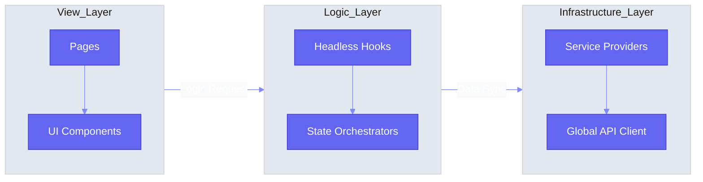

# Nexo Super-Admin | Engineering Portal

> **Vision**: To engineer a production-grade admin ecosystem that scales to 15 years of operational life. This portal serves as the single source of truth for our architectural standards and module health.

---

## 🏛️ System Topology
The following high-level visualization shows the unidirectional data flow and strict layering of the Nexo ecosystem.

---

## 📂 Feature Module Inventory
Automated audit of all system modules. This registry is synchronized on every local commit.

<!-- FEATURE_INVENTORY_START -->
| Status | Module | Complexity | Nodes | Topology |
| :--- | :--- | :--- | :--- | :--- |
|  | **ADMINS** | 538 LoC | 5 | [Open Spec](./src/features/admins/README.md) |
|  | **AUTH** | 1130 LoC | 11 | [Open Spec](./src/features/auth/README.md) |
|  | **BILLING** | 377 LoC | 2 | [Open Spec](./src/features/billing/README.md) |
|  | **CONTENT** | 283 LoC | 2 | [Open Spec](./src/features/content/README.md) |
|  | **DASHBOARD** | 787 LoC | 4 | [Open Spec](./src/features/dashboard/README.md) |
|  | **LOGS** | 667 LoC | 4 | [Open Spec](./src/features/logs/README.md) |
|  | **NOTIFICATIONS** | 512 LoC | 4 | [Open Spec](./src/features/notifications/README.md) |
|  | **ORGANIZATIONS** | 2452 LoC | 10 | [Open Spec](./src/features/organizations/README.md) |
|  | **PAYMENTS** | 756 LoC | 3 | [Open Spec](./src/features/payments/README.md) |
|  | **REQUESTS** | 646 LoC | 5 | [Open Spec](./src/features/requests/README.md) |
|  | **SETTINGS** | 870 LoC | 6 | [Open Spec](./src/features/settings/README.md) |
|  | **USERS** | 13 LoC | 1 | [Open Spec](./src/features/users/README.md) |
<!-- FEATURE_INVENTORY_END -->

---

## 🛠️ Engineering Standards

### 🛡️ Zero-Conflict Workflow
This project uses **Husky + Nexo Vision Engine** to ensure that documentation is always up-to-date locally. No more merge conflicts on READMEs.
- Documentation is generated at `git commit`.
- Architectural audits run before the code reaches the server.

### 🚀 Technical Stack
- **Engine**: Vite + React 18
- **Orchestration**: TanStack Query + TanStack Router
- **Visuals**: Framer Motion + Vanilla CSS Variables
- **Reliability**: Strictly Enforced 150-LoC File Limit

---
*Senior Lead Architect: Nexo Engineering AI*
