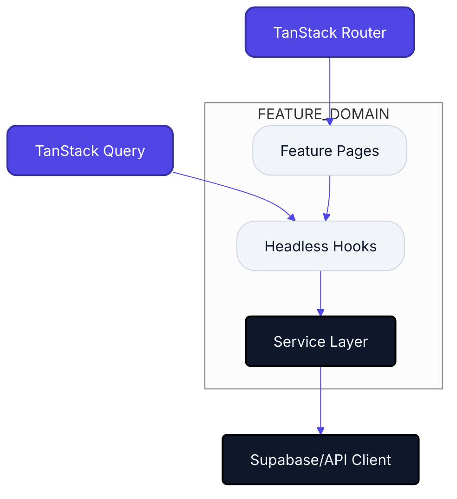

# Nexo Super-Admin | Engineering Command Center


> **Architectural Mission**: To build a mission-critical, self-documenting dashboard ecosystem. We enforce strict logic isolation and a unidirectional data flow to ensure long-term maintainability and zero technical debt.

### ⚡ [Open Nexo Pulse Dashboard](./docs/index.html)
*High-fidelity visual health audit of the entire codebase.*

---

## 🏛️ System Architecture Topology
The diagram below visualizes the core technical foundations of the Nexo ecosystem, illustrating how our primary libraries interact with our domain-driven feature layers.



---

## 📂 Feature Module Registry
The following registry is synchronized on every local commit. It provides a real-time health audit of all business domains.

<!-- FEATURE_INVENTORY_START -->

| Status | Feature Module | Complexity | Density | Specification |
| :--- | :--- | :--- | :--- | :--- |
|  | **ADMINS** | 538 LoC | 6 Nodes | [View Specs](./src/features/admins/README.md) |
|  | **AUTH** | 1130 LoC | 13 Nodes | [View Specs](./src/features/auth/README.md) |
|  | **BILLING** | 377 LoC | 3 Nodes | [View Specs](./src/features/billing/README.md) |
|  | **CONTENT** | 283 LoC | 3 Nodes | [View Specs](./src/features/content/README.md) |
|  | **DASHBOARD** | 787 LoC | 10 Nodes | [View Specs](./src/features/dashboard/README.md) |
|  | **LOGS** | 667 LoC | 7 Nodes | [View Specs](./src/features/logs/README.md) |
|  | **NOTIFICATIONS** | 512 LoC | 5 Nodes | [View Specs](./src/features/notifications/README.md) |
|  | **ORGANIZATIONS** | 2452 LoC | 22 Nodes | [View Specs](./src/features/organizations/README.md) |
|  | **PAYMENTS** | 756 LoC | 7 Nodes | [View Specs](./src/features/payments/README.md) |
|  | **REQUESTS** | 646 LoC | 8 Nodes | [View Specs](./src/features/requests/README.md) |
|  | **SETTINGS** | 870 LoC | 12 Nodes | [View Specs](./src/features/settings/README.md) |
|  | **USERS** | 13 LoC | 1 Nodes | [View Specs](./src/features/users/README.md) |

<!-- FEATURE_INVENTORY_END -->

---

## 🚀 Technical Standards & Guidelines

### 1. The 150-Line Hard Limit
No single file in the `src/` directory should exceed **150 lines**. 
- **Goal**: Forces modularity and prevents "God Components".
- **Enforcement**: Automatically audited during documentation sync.

### 2. Logic Sovereignty
- **UI Components**: Must be pure orchestrators. Zero complex state logic.
- **Headless Hooks**: 100% of business logic and API orchestration resides here.
- **Services**: Thin wrappers around external providers, ensuring we can swap infrastructure easily.

### 3. Zero-Conflict Automation
We use a **Local-First Sync** strategy. 
- Documentation is generated via **Husky** on `git commit`.
- This ensures your local environment is always the source of truth, eliminating merge conflicts on remote READMEs.

---

## 🛠️ Onboarding & Environment
```bash
# Clone and install dependencies
npm install

# Launch production-parity dev server
npm run dev

# Run comprehensive architecture audit
npm run lint
```

---
*Engineering Lead: Nexo AI Architect | Internal Technical Specification*
