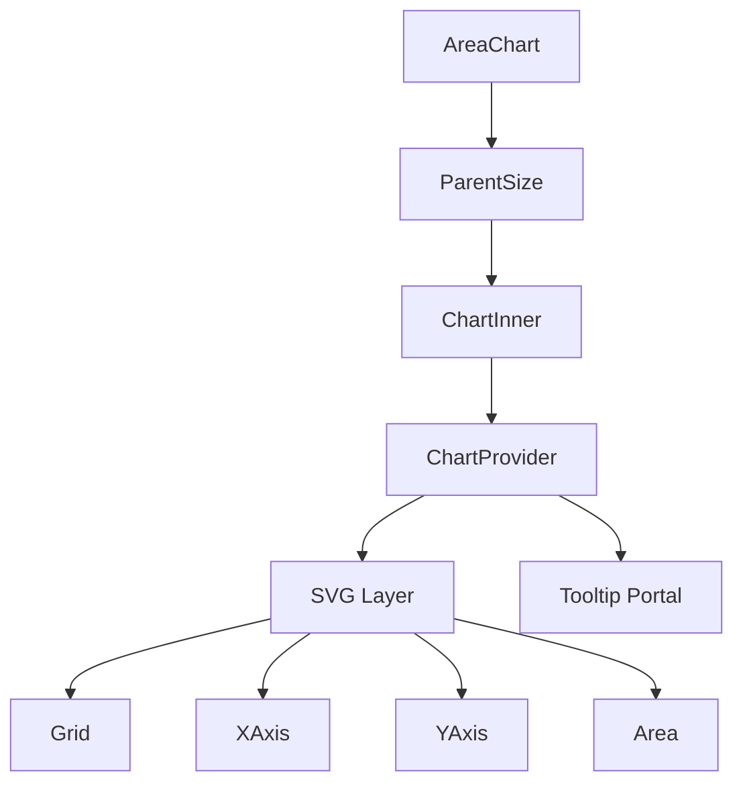

# AreaChart Component

Premium animated Area Chart built with `@visx`, `framer-motion`, and `d3-array`.

## 🏗️ Architecture
The component is split into several modular parts to ensure maintainability and stick to the 150-line rule:

- **AreaChart.jsx**: The main entry point that handles layout, responsive sizing, and orchestration using `ChartInner`.
- **ChartContext.js**: Manages shared configuration and state (scales, data, margins, tooltip) using React Context.
- **hooks/useChartInteraction.js**: Dedicated hook for handling mouse and touch interactions (tooltips, selection).
- **components/Area.jsx**: Handles the rendering of SVG paths, gradients, and interactive highlights for each data series.
- **components/ChartTooltip.jsx**: Portal-based tooltip system with sub-components for flexible display.
- **components/Grid.jsx**, **XAxis.jsx**, **YAxis.jsx**: Visual reference elements.

## 🚀 Key Features
- **Smooth Animations**: Leverages `framer-motion` for transitions and `visx` for SVG path generation.
- **High Performance**: Optimized using `useMemo` and `useCallback` to prevent unnecessary re-renders.
- **Customizable**: Flexible tooltip rendering and multi-series support.
- **Responsive**: Adapts to parent container size using `@visx/responsive`.

## 📂 Structure

