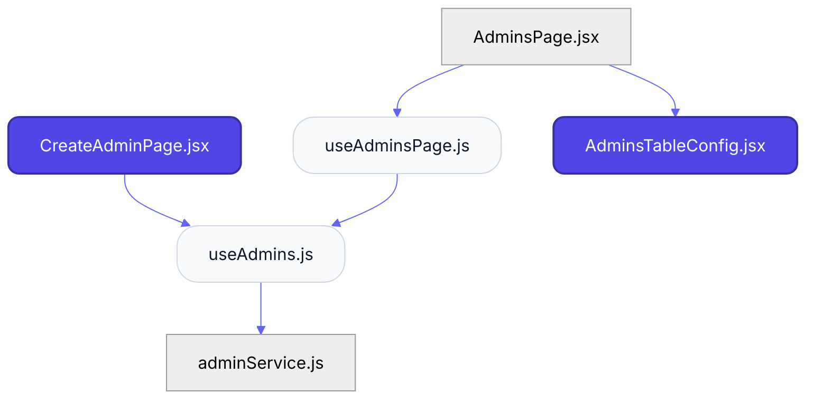
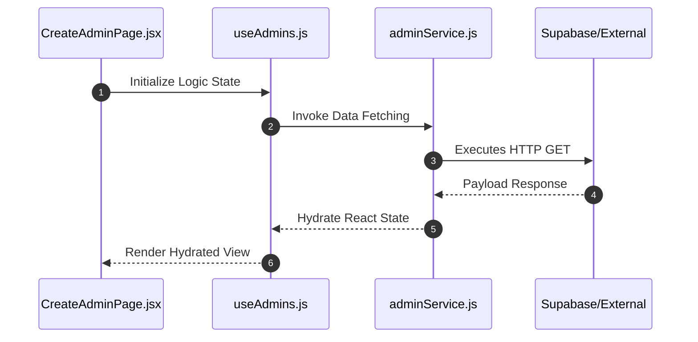

# Feature Intelligence: ADMINS

## 🏛️ Architectural Topology

### 1. Thematic Dependency Graph
Babel-parsed internal mapping of module relationships.

### 2. Execution Sequence
Runtime orchestration between View, Logic, and Infrastructure layers.

---

## 📡 API Surface (Inferred)
Automated mapping of external connectivity within this module.

| Method | Endpoint | Source Provider |
| :--- | :--- | :--- |
| - | - | - |

---

## 🛠️ Development Navigation
| Objective | Target Layer | Target File |
| :--- | :--- | :--- |
| **Change UI Layout** | Presentation (Pages) | `CreateAdminPage.jsx` |
| **Update Business Logic** | Logic (Hooks) | `useAdmins.js` |
| **Modify Data Provider** | Infrastructure (Services) | `featureService.js` |

---

## 📂 Engineering Audit
| Entity | Score | Complexity | LoC | Status |
| :--- | :--- | :--- | :--- | :--- |
| `AdminsPage.jsx` | 38 | Low | 83 | ✅ STABLE |
| `CreateAdminPage.jsx` | 85 | High | 206 | ⚠️ REFACTOR |
| `useAdmins.js` | 20 | Low | 64 | ✅ STABLE |
| `useAdminsPage.js` | 21 | Low | 87 | ✅ STABLE |
| `adminService.js` | 7 | Low | 14 | ✅ STABLE |
| `AdminsTableConfig.jsx` | 33 | Low | 84 | ✅ STABLE |

---
*Generated by Nexo Apex Architect V8.0 | Institutional Standard*
