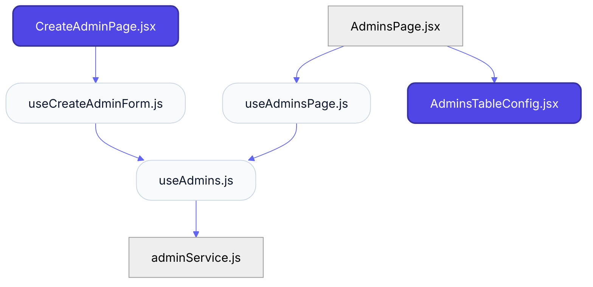
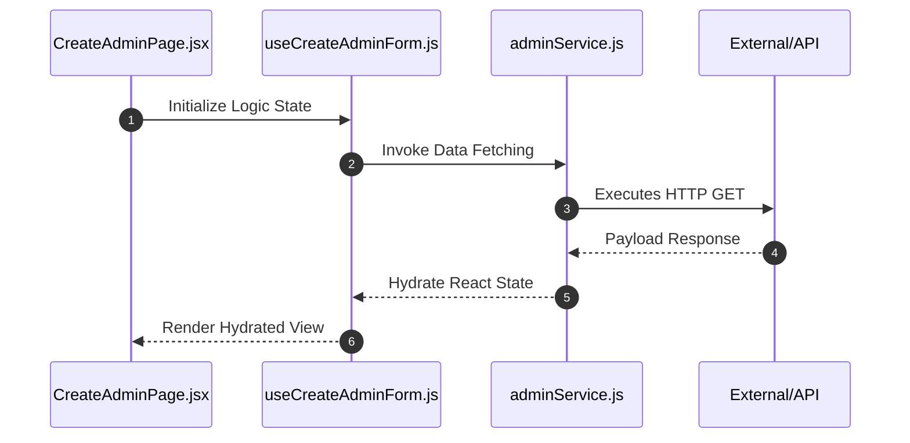

# Feature Intelligence: ADMINS

## 🏛️ Architectural Topology
### 1. Thematic Dependency Graph
Babel-parsed internal mapping of module relationships.

### 2. Execution Sequence
Runtime orchestration between View, Logic, and Infrastructure layers.

---

## 📡 API Surface (Inferred)
Automated mapping of external connectivity within this module.

| Method | Endpoint | Source Provider |
| :--- | :--- | :--- |
| - | - | - |

---

## 📂 Engineering Audit
| Entity | Score | Complexity | LoC | Status |
| :--- | :--- | :--- | :--- | :--- |
| `CreateAdminPage.jsx` | 32 | Low | 137 | ✅ STABLE |
| `useCreateAdminForm.js` | 56 | Low | 88 | ✅ STABLE |
| `useAdminsPage.js` | 57 | Low | 87 | ✅ STABLE |
| `AdminsTableConfig.jsx` | 58 | Low | 84 | ✅ STABLE |
| `AdminsPage.jsx` | 59 | Low | 83 | ✅ STABLE |
| `useAdmins.js` | 68 | Low | 64 | ✅ STABLE |
| `adminService.js` | 93 | Low | 14 | ✅ STABLE |

---
*Generated by Nexo Master Architect V24.0 | Institutional Standard*