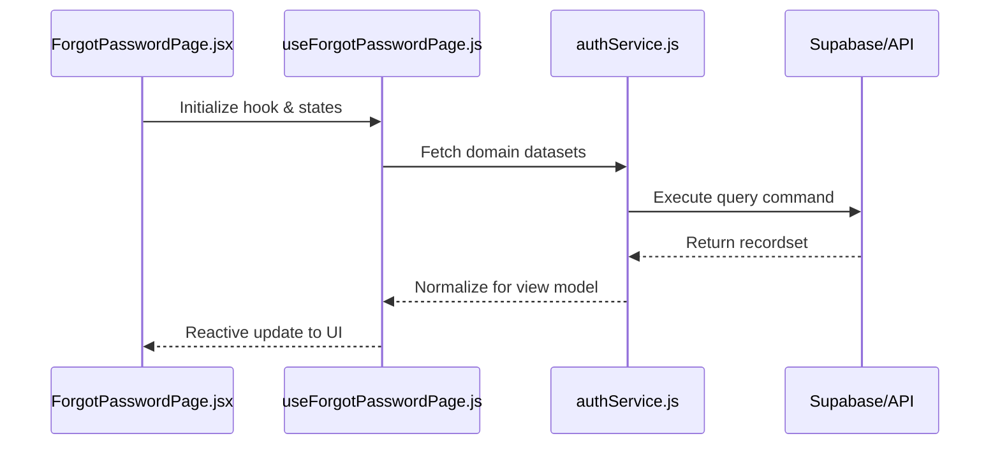
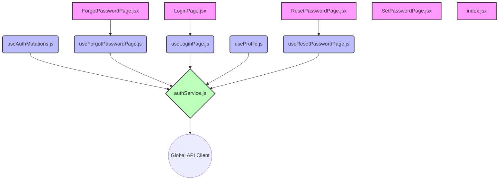

# Technical Specification: AUTH

## 🏛️ Domain Architecture

### Execution Sequence
How the view orchestrates logic through the headless hook layer.

### Dependency Topology
A visual map of file-level relationships within the auth module.

## 📂 Implementation Audit

### 📄 Presentation (Pages)
| Entity | Logic Link | Complexity |
| :--- | :--- | :--- |
| `ForgotPasswordPage.jsx` | Direct | 125 LoC |
| `LoginPage.jsx` | Direct | 130 LoC |
| `ResetPasswordPage.jsx` | Direct | 171 LoC |
| `SetPasswordPage.jsx` | Isolated | 262 LoC |
| `index.jsx` | Isolated | 5 LoC |

### ⚓ Headless Logic (Hooks)
| Controller | Domain Exports | Status |
| :--- | :--- | :--- |
| `useAuthMutations.js` | 4 handlers | Stable |
| `useForgotPasswordPage.js` | 1 handlers | Stable |
| `useLoginPage.js` | 1 handlers | Stable |
| `useProfile.js` | 1 handlers | Stable |
| `useResetPasswordPage.js` | 1 handlers | Stable |

### ⚡ Infrastructure (Services)
| Provider | Connectivity | Exports |
| :--- | :--- | :--- |
| `authService.js` | Global API | 1 methods |

## 🎓 Technical Interview Highlights
- **Layered Decoupling**: The View Layer (5 nodes) has zero knowledge of API protocols, interacting only through `useAuthMutations`.
- **Service Abstraction**: `authService` encapsulates all Supabase/REST logic, allowing for provider-agnostic business logic.
- **State Management**: Uses TanStack Query for server state and local useState/useReducer for UI-only transient states.

---
*Verified by Nexo Engineering Standards v5.0 | 2026*
