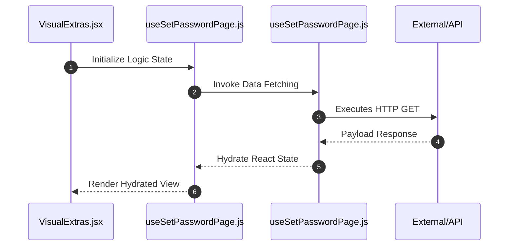

# Feature Intelligence: AUTH

## 🏛️ Architectural Topology
### 1. Thematic Dependency Graph
Babel-parsed internal mapping of module relationships.

```mermaid
%%{init: {'theme': 'neutral', 'themeVariables': { 'fontFamily': 'Inter', 'lineColor': '#6366f1' }}}%%
graph TD
    classDef page fill:#4f46e5,stroke:#3730a3,stroke-width:2px,color:#fff,rx:10,ry:10;
    classDef hook fill:#f8fafc,stroke:#cbd5e1,stroke-width:1px,color:#0f172a,rx:20,ry:20;
    classDef service fill:#0f172a,stroke:#000,stroke-width:2px,color:#f1f5f9,rx:5,ry:5;

    VisualExtrasjsx["VisualExtras.jsx"]:::page
    DashboardCardsjsx["DashboardCards.jsx"]:::page
    LoginPagejsx["LoginPage.jsx"]:::page
    ForgotPasswordPagejsx["ForgotPasswordPage.jsx"]:::page
    SetPasswordPagejsx["SetPasswordPage.jsx"]:::page
    ResetPasswordPagejsx["ResetPasswordPage.jsx"]:::page
    AuthAlertjsx["AuthAlert.jsx"]:::page
    useSetPasswordPagejs["useSetPasswordPage.js"]:::hook
    useAuthMutationsjs["useAuthMutations.js"]:::hook
    useLoginPagejs["useLoginPage.js"]:::hook
    useResetPasswordPagejs["useResetPasswordPage.js"]:::hook
    useProfilejs["useProfile.js"]:::hook
    AuthVisualjsx["AuthVisual.jsx"]:::page
    PasswordRequirementsjsx["PasswordRequirements.jsx"]:::page
    useForgotPasswordPagejs["useForgotPasswordPage.js"]:::hook
    AuthSuccessStatejsx["AuthSuccessState.jsx"]:::page
    authServicejs["authService.js"]:::service
    indexjs["index.js"]
    LoginPagejsx --> AuthAlertjsx
    LoginPagejsx --> useLoginPagejs
    ForgotPasswordPagejsx --> AuthAlertjsx
    ForgotPasswordPagejsx --> useForgotPasswordPagejs
    SetPasswordPagejsx --> AuthAlertjsx
    SetPasswordPagejsx --> AuthSuccessStatejsx
    SetPasswordPagejsx --> PasswordRequirementsjsx
    SetPasswordPagejsx --> useSetPasswordPagejs
    ResetPasswordPagejsx --> AuthAlertjsx
    ResetPasswordPagejsx --> AuthSuccessStatejsx
    ResetPasswordPagejsx --> useResetPasswordPagejs
    useSetPasswordPagejs --> authServicejs
    useAuthMutationsjs --> authServicejs
    useLoginPagejs --> useAuthMutationsjs
    useResetPasswordPagejs --> useAuthMutationsjs
    useProfilejs --> authServicejs
    AuthVisualjsx --> DashboardCardsjsx
    AuthVisualjsx --> VisualExtrasjsx
    useForgotPasswordPagejs --> useAuthMutationsjs
```

### 2. Execution Sequence
Runtime orchestration between View, Logic, and Infrastructure layers.

---

## 📡 API Surface (Inferred)
Automated mapping of external connectivity within this module.

| Method | Endpoint | Source Provider |
| :--- | :--- | :--- |
| GET | `token` | useSetPasswordPage.js |
| GET | `email` | useSetPasswordPage.js |
| GET | `token` | useResetPasswordPage.js |
| POST | `/auth/login` | authService.js |
| POST | `/auth/logout` | authService.js |
| POST | `/auth/forgot-password` | authService.js |
| POST | `/auth/reset-password` | authService.js |
| GET | `/auth/profile` | authService.js |
| PATCH | `/auth/profile` | authService.js |
| POST | `/auth/change-password` | authService.js |

---

## 📂 Engineering Audit
| Entity | Score | Complexity | LoC | Status |
| :--- | :--- | :--- | :--- | :--- |
| `VisualExtras.jsx` | 19 | Low | 163 | ✅ STABLE |
| `DashboardCards.jsx` | 25 | Low | 151 | ✅ STABLE |
| `LoginPage.jsx` | 35 | Low | 130 | ✅ STABLE |
| `ForgotPasswordPage.jsx` | 38 | High | 125 | ⚠️ REFACTOR |
| `SetPasswordPage.jsx` | 41 | Low | 118 | ✅ STABLE |
| `ResetPasswordPage.jsx` | 42 | Low | 116 | ✅ STABLE |
| `AuthAlert.jsx` | 45 | Low | 110 | ✅ STABLE |
| `useSetPasswordPage.js` | 55 | Low | 90 | ✅ STABLE |
| `useAuthMutations.js` | 67 | Low | 66 | ✅ STABLE |
| `useLoginPage.js` | 73 | Low | 55 | ✅ STABLE |
| `useResetPasswordPage.js` | 73 | Low | 55 | ✅ STABLE |
| `useProfile.js` | 76 | Low | 48 | ✅ STABLE |
| `AuthVisual.jsx` | 76 | Low | 48 | ✅ STABLE |
| `PasswordRequirements.jsx` | 77 | Low | 46 | ✅ STABLE |
| `useForgotPasswordPage.js` | 80 | Low | 41 | ✅ STABLE |
| `AuthSuccessState.jsx` | 86 | Low | 29 | ✅ STABLE |
| `authService.js` | 93 | Low | 14 | ✅ STABLE |
| `index.js` | 98 | Low | 5 | ✅ STABLE |

---
*Generated by Nexo Master Architect V24.0 | Institutional Standard*