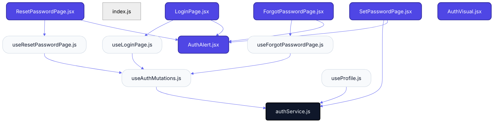
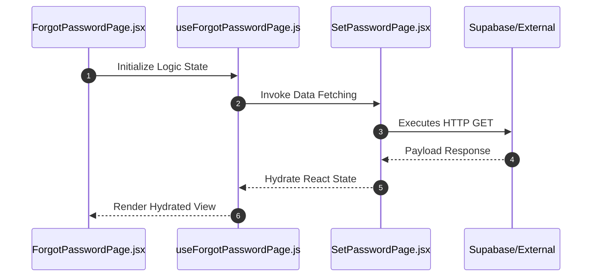

# Feature Intelligence: AUTH

## 🏛️ Architectural Topology

### 1. Thematic Dependency Graph
Babel-parsed internal mapping of module relationships.

### 2. Execution Sequence
Runtime orchestration between View, Logic, and Infrastructure layers.

---

## 📡 API Surface (Inferred)
Automated mapping of external connectivity within this module.

| Method | Endpoint | Source Provider |
| :--- | :--- | :--- |
| GET | `token` | SetPasswordPage.jsx |
| GET | `email` | SetPasswordPage.jsx |
| GET | `token` | useResetPasswordPage.js |
| POST | `/auth/login` | authService.js |
| POST | `/auth/logout` | authService.js |
| POST | `/auth/forgot-password` | authService.js |
| POST | `/auth/reset-password` | authService.js |
| GET | `/auth/profile` | authService.js |
| PATCH | `/auth/profile` | authService.js |
| POST | `/auth/change-password` | authService.js |

---

## 🛠️ Development Navigation
| Objective | Target Layer | Target File |
| :--- | :--- | :--- |
| **Change UI Layout** | Presentation (Pages) | `ForgotPasswordPage.jsx` |
| **Update Business Logic** | Logic (Hooks) | `useAuthMutations.js` |
| **Modify Data Provider** | Infrastructure (Services) | `SetPasswordPage.jsx` |

---

## 📂 Engineering Audit
| Entity | Score | Complexity | LoC | Status |
| :--- | :--- | :--- | :--- | :--- |
| `ForgotPasswordPage.jsx` | 55 | Low | 125 | ✅ STABLE |
| `index.js` | 1 | Low | 5 | ✅ STABLE |
| `LoginPage.jsx` | 51 | Low | 130 | ✅ STABLE |
| `ResetPasswordPage.jsx` | 64 | Low | 171 | ⚠️ REFACTOR |
| `SetPasswordPage.jsx` | 99 | High | 262 | ⚠️ REFACTOR |
| `useAuthMutations.js` | 20 | Low | 66 | ✅ STABLE |
| `useForgotPasswordPage.js` | 14 | Low | 41 | ✅ STABLE |
| `useLoginPage.js` | 18 | Low | 55 | ✅ STABLE |
| `useProfile.js` | 17 | Low | 48 | ✅ STABLE |
| `useResetPasswordPage.js` | 23 | Low | 55 | ✅ STABLE |
| `authService.js` | 42 | Low | 14 | ✅ STABLE |
| `AuthAlert.jsx` | 37 | Low | 110 | ✅ STABLE |
| `AuthVisual.jsx` | 29 | Low | 48 | ✅ STABLE |

---
*Generated by Nexo Apex Architect V8.0 | Institutional Standard*
