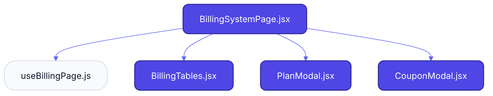
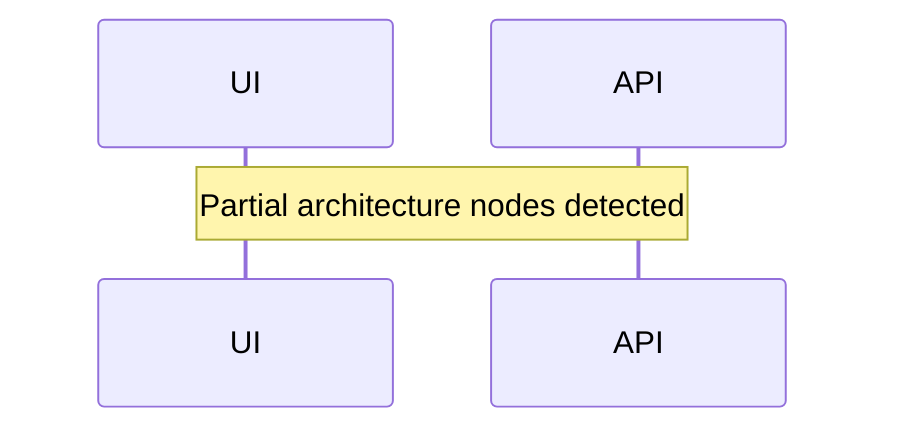

# Feature Intelligence: BILLING

## 🏛️ Architectural Topology
### 1. Thematic Dependency Graph
Babel-parsed internal mapping of module relationships.

### 2. Execution Sequence
Runtime orchestration between View, Logic, and Infrastructure layers.

---

## 📡 API Surface (Inferred)
Automated mapping of external connectivity within this module.

| Method | Endpoint | Source Provider |
| :--- | :--- | :--- |
| - | - | - |

---

## 📂 Engineering Audit
| Entity | Score | Complexity | LoC | Status |
| :--- | :--- | :--- | :--- | :--- |
| `BillingTables.jsx` | 8 | Low | 185 | ✅ STABLE |
| `BillingSystemPage.jsx` | 25 | Low | 151 | ✅ STABLE |
| `CouponModal.jsx` | 43 | Low | 114 | ✅ STABLE |
| `PlanModal.jsx` | 44 | Low | 113 | ✅ STABLE |
| `useBillingPage.js` | 80 | Low | 41 | ✅ STABLE |

---
*Generated by Nexo Master Architect V24.0 | Institutional Standard*