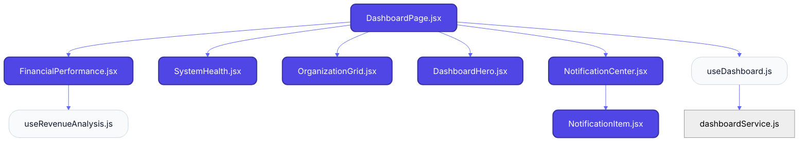
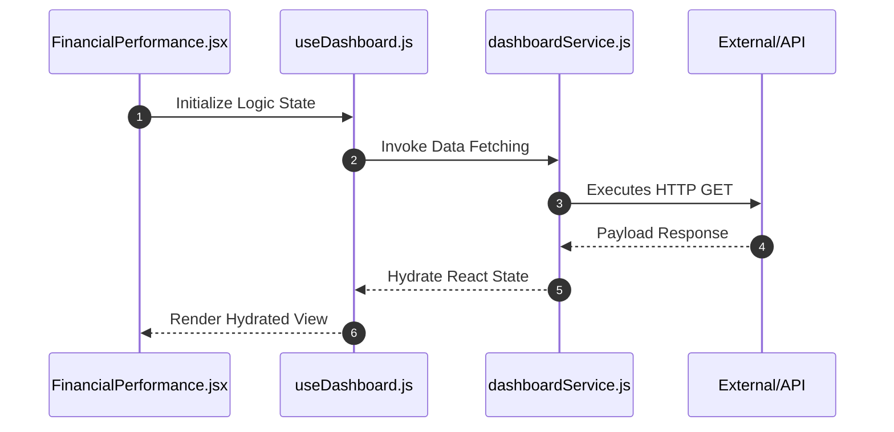

# Feature Intelligence: DASHBOARD

## 🏛️ Architectural Topology
### 1. Thematic Dependency Graph
Babel-parsed internal mapping of module relationships.

### 2. Execution Sequence
Runtime orchestration between View, Logic, and Infrastructure layers.

---

## 📡 API Surface (Inferred)
Automated mapping of external connectivity within this module.

| Method | Endpoint | Source Provider |
| :--- | :--- | :--- |
| - | - | - |

---

## 📂 Engineering Audit
| Entity | Score | Complexity | LoC | Status |
| :--- | :--- | :--- | :--- | :--- |
| `FinancialPerformance.jsx` | 35 | Low | 131 | ✅ STABLE |
| `SystemHealth.jsx` | 37 | Low | 126 | ✅ STABLE |
| `OrganizationGrid.jsx` | 53 | Low | 95 | ✅ STABLE |
| `DashboardPage.jsx` | 59 | Low | 82 | ✅ STABLE |
| `DashboardHero.jsx` | 66 | Low | 69 | ✅ STABLE |
| `NotificationItem.jsx` | 68 | Low | 64 | ✅ STABLE |
| `NotificationCenter.jsx` | 74 | Low | 53 | ✅ STABLE |
| `dashboardService.js` | 74 | Low | 52 | ✅ STABLE |
| `useDashboard.js` | 77 | Low | 46 | ✅ STABLE |
| `useRevenueAnalysis.js` | 84 | Low | 32 | ✅ STABLE |

---
*Generated by Nexo Master Architect V24.0 | Institutional Standard*