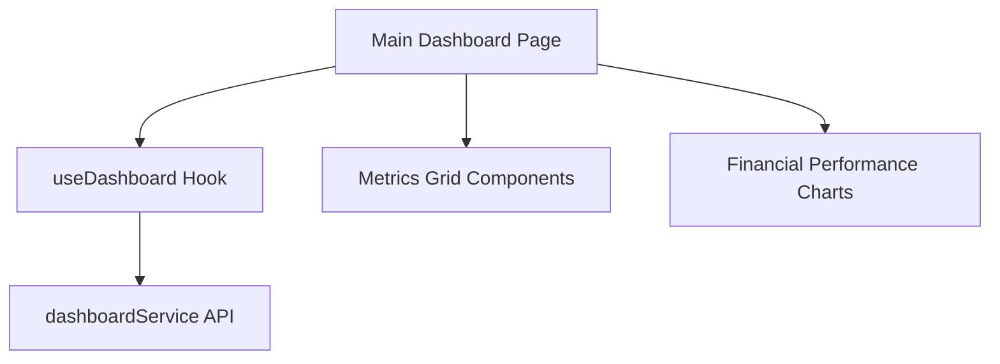

# Dashboard Feature Architecture

Strategic intelligence layer for Nexo-Admin oversight.

## 📁 Structure

- **services/dashboardService.js**: Aggregates high-level metrics and system status APIs.
- **hooks/useDashboard.js**: Transforms raw status data into UI-ready metrics and trend indicators.
- **components/**: Visual representation of financial performance, organization grids, and system health.
- **constants/**: Configuration for metric cards and fallback mock data.

## 🏗️ Data Flow

## 🚀 Vision

Built for real-time monitoring of all organization-wide activities with minimal latency and high visual fidelity.
