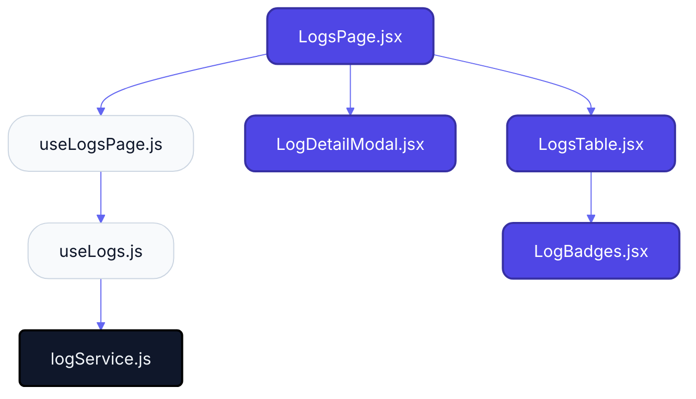
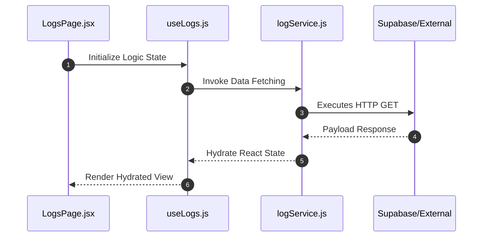

# Feature Intelligence: LOGS

## 🏛️ Architectural Topology

### 1. Thematic Dependency Graph
Babel-parsed internal mapping of module relationships.

### 2. Execution Sequence
Runtime orchestration between View, Logic, and Infrastructure layers.

---

## 📡 API Surface (Inferred)
Automated mapping of external connectivity within this module.

| Method | Endpoint | Source Provider |
| :--- | :--- | :--- |
| GET | `/system/logs` | logService.js |

---

## 🛠️ Development Navigation
| Objective | Target Layer | Target File |
| :--- | :--- | :--- |
| **Change UI Layout** | Presentation (Pages) | `LogsPage.jsx` |
| **Update Business Logic** | Logic (Hooks) | `useLogs.js` |
| **Modify Data Provider** | Infrastructure (Services) | `logService.js` |

---

## 📂 Engineering Audit
| Entity | Score | Complexity | LoC | Status |
| :--- | :--- | :--- | :--- | :--- |
| `LogsPage.jsx` | 49 | Low | 111 | ✅ STABLE |
| `useLogs.js` | 10 | Low | 16 | ✅ STABLE |
| `useLogsPage.js` | 19 | Low | 78 | ✅ STABLE |
| `logService.js` | 11 | Low | 8 | ✅ STABLE |
| `LogBadges.jsx` | 20 | Low | 71 | ✅ STABLE |
| `LogDetailModal.jsx` | 77 | Low | 209 | ⚠️ REFACTOR |
| `LogsTable.jsx` | 60 | Low | 174 | ⚠️ REFACTOR |

---
*Generated by Nexo Apex Architect V8.0 | Institutional Standard*
