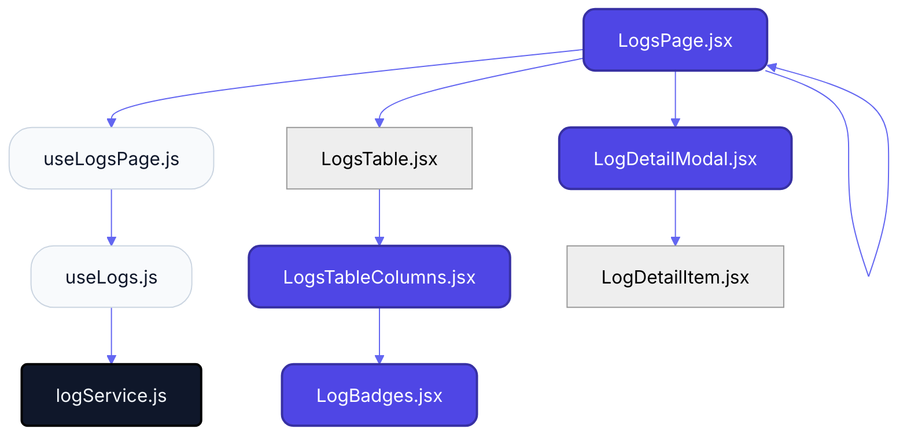
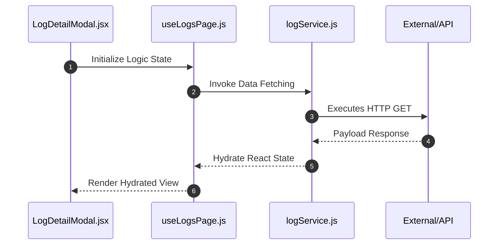

# Feature Intelligence: LOGS

## 🏛️ Architectural Topology
### 1. Thematic Dependency Graph
Babel-parsed internal mapping of module relationships.

### 2. Execution Sequence
Runtime orchestration between View, Logic, and Infrastructure layers.

---

## 📡 API Surface (Inferred)
Automated mapping of external connectivity within this module.

| Method | Endpoint | Source Provider |
| :--- | :--- | :--- |
| GET | `/system/logs` | logService.js |

---

## 📂 Engineering Audit
| Entity | Score | Complexity | LoC | Status |
| :--- | :--- | :--- | :--- | :--- |
| `LogDetailModal.jsx` | 43 | High | 114 | ⚠️ REFACTOR |
| `LogsPage.jsx` | 45 | Low | 111 | ✅ STABLE |
| `LogsTableColumns.jsx` | 54 | Low | 93 | ✅ STABLE |
| `useLogsPage.js` | 61 | Low | 78 | ✅ STABLE |
| `LogBadges.jsx` | 65 | Low | 71 | ✅ STABLE |
| `LogsTable.jsx` | 74 | Low | 52 | ✅ STABLE |
| `useLogs.js` | 92 | Low | 16 | ✅ STABLE |
| `LogDetailItem.jsx` | 93 | Low | 14 | ✅ STABLE |
| `logService.js` | 96 | Low | 8 | ✅ STABLE |

---
*Generated by Nexo Master Architect V24.0 | Institutional Standard*