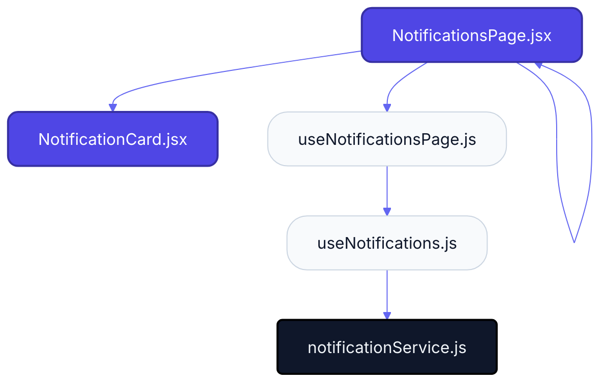
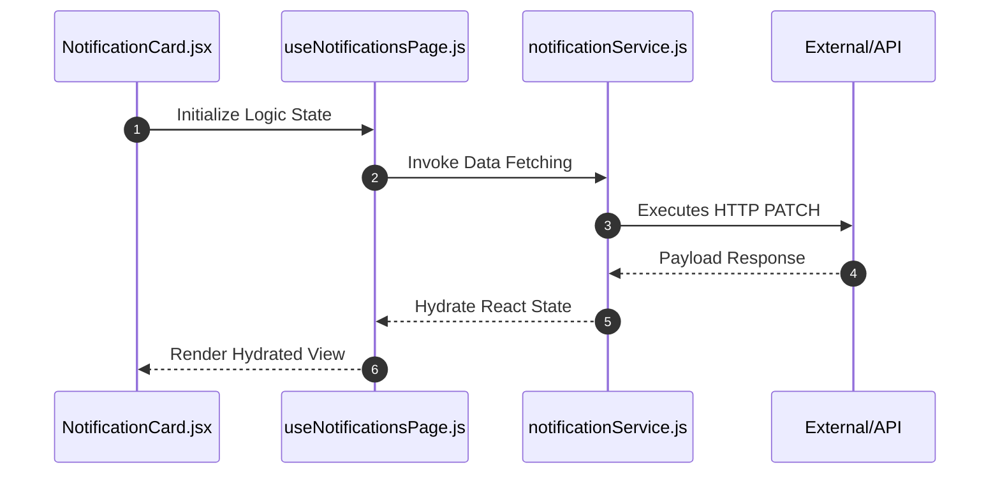

# Feature Intelligence: NOTIFICATIONS

## 🏛️ Architectural Topology
### 1. Thematic Dependency Graph
Babel-parsed internal mapping of module relationships.

### 2. Execution Sequence
Runtime orchestration between View, Logic, and Infrastructure layers.

---

## 📡 API Surface (Inferred)
Automated mapping of external connectivity within this module.

| Method | Endpoint | Source Provider |
| :--- | :--- | :--- |
| PATCH | `/notifications/mark-all-read` | notificationService.js |
| DELETE | `/notifications` | notificationService.js |
| DELETE | `/notifications/unread` | notificationService.js |
| POST | `/notifications/seen` | notificationService.js |

---

## 📂 Engineering Audit
| Entity | Score | Complexity | LoC | Status |
| :--- | :--- | :--- | :--- | :--- |
| `NotificationCard.jsx` | 30 | Low | 140 | ✅ STABLE |
| `NotificationsPage.jsx` | 36 | Low | 129 | ✅ STABLE |
| `useNotificationsPage.js` | 49 | Low | 103 | ✅ STABLE |
| `useNotifications.js` | 61 | Low | 79 | ✅ STABLE |
| `notificationService.js` | 88 | Low | 24 | ✅ STABLE |

---
*Generated by Nexo Master Architect V24.0 | Institutional Standard*