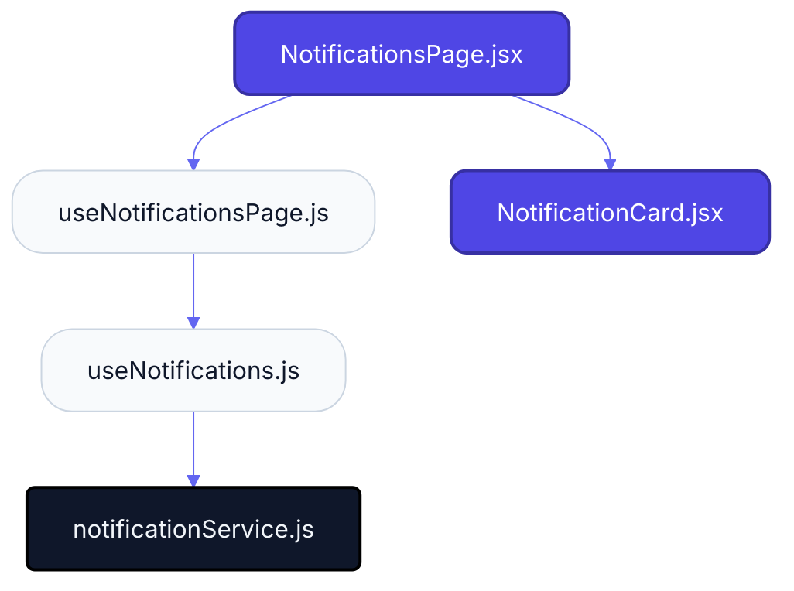
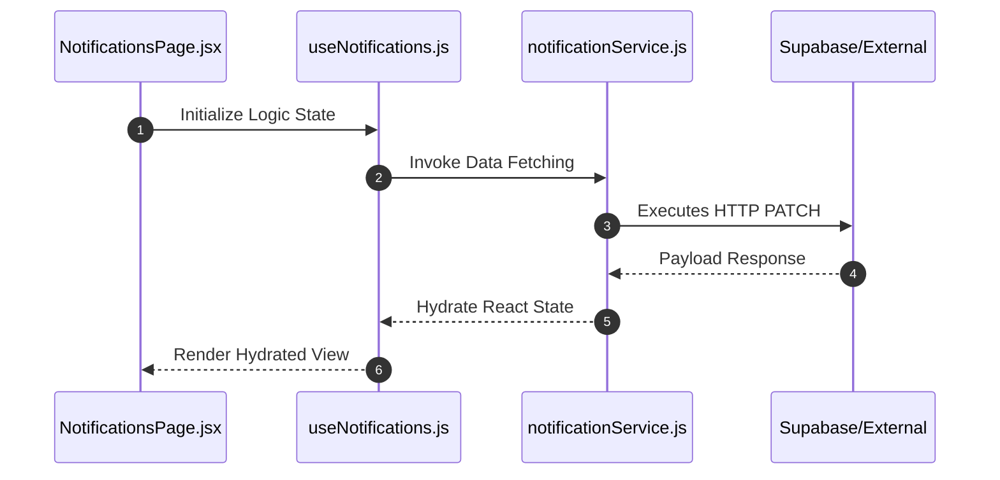

# Feature Intelligence: NOTIFICATIONS

## 🏛️ Architectural Topology

### 1. Thematic Dependency Graph
Babel-parsed internal mapping of module relationships.

### 2. Execution Sequence
Runtime orchestration between View, Logic, and Infrastructure layers.

---

## 📡 API Surface (Inferred)
Automated mapping of external connectivity within this module.

| Method | Endpoint | Source Provider |
| :--- | :--- | :--- |
| PATCH | `/notifications/mark-all-read` | notificationService.js |
| DELETE | `/notifications` | notificationService.js |
| DELETE | `/notifications/unread` | notificationService.js |
| POST | `/notifications/seen` | notificationService.js |

---

## 🛠️ Development Navigation
| Objective | Target Layer | Target File |
| :--- | :--- | :--- |
| **Change UI Layout** | Presentation (Pages) | `NotificationsPage.jsx` |
| **Update Business Logic** | Logic (Hooks) | `useNotifications.js` |
| **Modify Data Provider** | Infrastructure (Services) | `notificationService.js` |

---

## 📂 Engineering Audit
| Entity | Score | Complexity | LoC | Status |
| :--- | :--- | :--- | :--- | :--- |
| `NotificationsPage.jsx` | 67 | Low | 166 | ⚠️ REFACTOR |
| `useNotifications.js` | 22 | Low | 79 | ✅ STABLE |
| `useNotificationsPage.js` | 25 | Low | 103 | ✅ STABLE |
| `notificationService.js` | 28 | Low | 24 | ✅ STABLE |
| `NotificationCard.jsx` | 62 | Low | 140 | ✅ STABLE |

---
*Generated by Nexo Apex Architect V8.0 | Institutional Standard*
