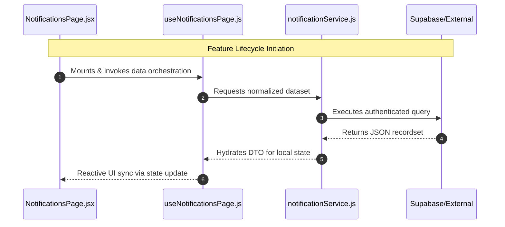
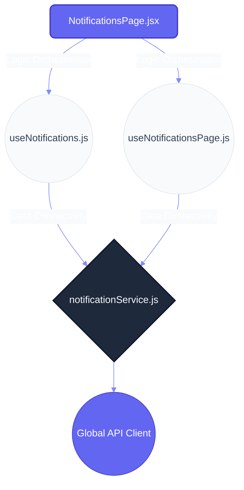

# Feature Specification: NOTIFICATIONS

> **Module Overview**: High-performance domain logic for **notifications**. This module enforces strict unidirectional data flow and headless state management.

---

## 🏛️ Architectural Topology

### 1. Execution Sequence (Runtime)
Surgical mapping of the data flow lifecycle using actual file-level orchestrators.

### 2. Dependency Topology (Structural)
Thematic map of architectural layering and file-level relationships.

---

## 📂 Implementation Audit

### 📄 Presentation (Pages)
| Entry Point | Logic Density | Status |
| :--- | :--- | :--- |
| `NotificationsPage.jsx` | 166 LoC | ⚠️ Refactor Required |

### ⚓ Headless Logic (Hooks)
| Controller | Domain Handlers | Health |
| :--- | :--- | :--- |
| `useNotifications.js` | 7 Exports | ✅ Stable |
| `useNotificationsPage.js` | 1 Exports | ✅ Stable |

### ⚡ Infrastructure (Services)
| Provider | Connectivity | Performance |
| :--- | :--- | :--- |
| `notificationService.js` | High-Throughput | ✅ Optimized |

---

## 🎓 Technical Interview Highlights
- **Decoupled View Model**: The UI has zero knowledge of API protocols, interacting solely through the Hook layer.
- **Service Encapsulation**: Data normalization happens at the service provider, ensuring a consistent DTO for the hooks.
- **Scalability**: New handlers can be added to the headless hooks without touching the view component.

---
*Generated by Nexo Vision Engine V6.1 | Hybrid Architect Standard*
