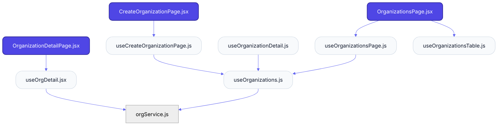
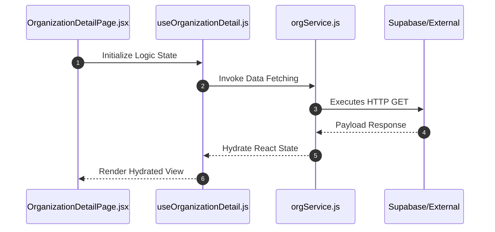

# Feature Intelligence: ORGANIZATIONS

## 🏛️ Architectural Topology

### 1. Thematic Dependency Graph
Babel-parsed internal mapping of module relationships.

### 2. Execution Sequence
Runtime orchestration between View, Logic, and Infrastructure layers.

---

## 📡 API Surface (Inferred)
Automated mapping of external connectivity within this module.

| Method | Endpoint | Source Provider |
| :--- | :--- | :--- |
| - | - | - |

---

## 🛠️ Development Navigation
| Objective | Target Layer | Target File |
| :--- | :--- | :--- |
| **Change UI Layout** | Presentation (Pages) | `OrganizationDetailPage.jsx` |
| **Update Business Logic** | Logic (Hooks) | `useCreateOrganizationPage.js` |
| **Modify Data Provider** | Infrastructure (Services) | `featureService.js` |

---

## 📂 Engineering Audit
| Entity | Score | Complexity | LoC | Status |
| :--- | :--- | :--- | :--- | :--- |
| `CreateOrganizationPage.jsx` | 42 | Low | 59 | ✅ STABLE |
| `OrganizationDetailPage.jsx` | 55 | Low | 67 | ✅ STABLE |
| `OrganizationsPage.jsx` | 45 | Low | 84 | ✅ STABLE |
| `useCreateOrganizationPage.js` | 23 | Low | 84 | ✅ STABLE |
| `useOrgDetail.jsx` | 35 | Low | 101 | ✅ STABLE |
| `useOrganizationDetail.js` | 21 | Low | 72 | ✅ STABLE |
| `useOrganizations.js` | 28 | Low | 121 | ✅ STABLE |
| `useOrganizationsPage.js` | 21 | Low | 88 | ✅ STABLE |
| `useOrganizationsTable.js` | 22 | Low | 82 | ✅ STABLE |
| `orgService.js` | 17 | Low | 64 | ✅ STABLE |

---
*Generated by Nexo Apex Architect V8.0 | Institutional Standard*
