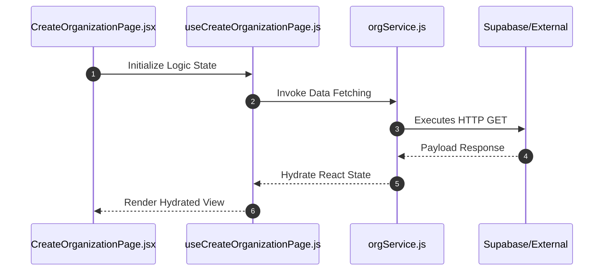

# Feature Intelligence: ORGANIZATIONS

## 🏛️ Architectural Topology

### 1. Thematic Dependency Graph
Babel-parsed internal mapping of module relationships.

```mermaid
%%{init: {'theme': 'neutral', 'themeVariables': { 'fontFamily': 'Inter', 'lineColor': '#6366f1' }}}%%
graph TD
    classDef page fill:#4f46e5,stroke:#3730a3,stroke-width:2px,color:#fff,rx:10,ry:10;
    classDef hook fill:#f8fafc,stroke:#cbd5e1,stroke-width:1px,color:#0f172a,rx:20,ry:20;
    classDef service fill:#0f172a,stroke:#000,stroke-width:2px,color:#f1f5f9,rx:5,ry:5;

    CreateOrganizationPagejsx["CreateOrganizationPage.jsx"]:::page
    OrganizationDetailPagejsx["OrganizationDetailPage.jsx"]:::page
    OrganizationsPagejsx["OrganizationsPage.jsx"]:::page
    useCreateOrganizationPagejs["useCreateOrganizationPage.js"]:::hook
    useOrganizationDetailjs["useOrganizationDetail.js"]:::hook
    useOrganizationsjs["useOrganizations.js"]:::hook
    useOrganizationsPagejs["useOrganizationsPage.js"]:::hook
    useOrganizationsTablejs["useOrganizationsTable.js"]:::hook
    useOrgDetailjsx["useOrgDetail.jsx"]:::hook
    orgServicejs["orgService.js"]
    FormSkeletonjsx["FormSkeleton.jsx"]:::page
    OrganizationsTablejsx["OrganizationsTable.jsx"]:::page
    OrgChartsjsx["OrgCharts.jsx"]:::page
    OrgColumnsjsx["OrgColumns.jsx"]:::page
    OrgHerojsx["OrgHero.jsx"]:::page
    OrgInfojsx["OrgInfo.jsx"]:::page
    OrgModalsjsx["OrgModals.jsx"]
    OrgSidebarjsx["OrgSidebar.jsx"]:::page
    OrgSkeletonjsx["OrgSkeleton.jsx"]:::page
    OrgStatsjsx["OrgStats.jsx"]
    OrgStatsOverviewjsx["OrgStatsOverview.jsx"]
    StatusDropdownjsx["StatusDropdown.jsx"]
    CreateOrganizationPagejsx --> useCreateOrganizationPagejs
    CreateOrganizationPagejsx --> FormSkeletonjsx
    OrganizationDetailPagejsx --> OrgHerojsx
    OrganizationDetailPagejsx --> OrgInfojsx
    OrganizationDetailPagejsx --> OrgSidebarjsx
    OrganizationDetailPagejsx --> OrgChartsjsx
    OrganizationDetailPagejsx --> OrgStatsOverviewjsx
    OrganizationDetailPagejsx --> OrgModalsjsx
    OrganizationDetailPagejsx --> useOrgDetailjsx
    OrganizationsPagejsx --> useOrganizationsTablejs
    OrganizationsPagejsx --> useOrganizationsPagejs
    useCreateOrganizationPagejs --> useOrganizationsjs
    useOrganizationDetailjs --> useOrganizationsjs
    useOrganizationsjs --> orgServicejs
    useOrganizationsPagejs --> useOrganizationsjs
    useOrganizationsTablejs --> OrgColumnsjsx
    useOrgDetailjsx --> orgServicejs
    OrganizationsTablejsx --> OrgModalsjsx
    OrganizationsTablejsx --> useOrganizationsTablejs
    OrgColumnsjsx --> StatusDropdownjsx
```

### 2. Execution Sequence
Runtime orchestration between View, Logic, and Infrastructure layers.

---

## 📡 API Surface (Inferred)
Automated mapping of external connectivity within this module.

| Method | Endpoint | Source Provider |
| :--- | :--- | :--- |
| - | - | - |

---

## 🛠️ Development Navigation
| Objective | Target Layer | Target File |
| :--- | :--- | :--- |
| **Change UI Layout** | Presentation (Pages) | `CreateOrganizationPage.jsx` |
| **Update Business Logic** | Logic (Hooks) | `useCreateOrganizationPage.js` |
| **Modify Data Provider** | Infrastructure (Services) | `featureService.js` |

---

## 📂 Engineering Audit
| Entity | Score | Complexity | LoC | Status |
| :--- | :--- | :--- | :--- | :--- |
| `CreateOrganizationPage.jsx` | 117 | High | 270 | ⚠️ REFACTOR |
| `OrganizationDetailPage.jsx` | 76 | Low | 162 | ⚠️ REFACTOR |
| `OrganizationsPage.jsx` | 72 | Low | 202 | ⚠️ REFACTOR |
| `useCreateOrganizationPage.js` | 34 | Low | 163 | ⚠️ REFACTOR |
| `useOrganizationDetail.js` | 21 | Low | 72 | ✅ STABLE |
| `useOrganizations.js` | 28 | Low | 121 | ✅ STABLE |
| `useOrganizationsPage.js` | 21 | Low | 88 | ✅ STABLE |
| `useOrganizationsTable.js` | 22 | Low | 82 | ✅ STABLE |
| `useOrgDetail.jsx` | 35 | Low | 101 | ✅ STABLE |
| `orgService.js` | 30 | Low | 171 | ⚠️ REFACTOR |
| `FormSkeleton.jsx` | 16 | Low | 31 | ✅ STABLE |
| `OrganizationsTable.jsx` | 37 | Low | 101 | ✅ STABLE |
| `OrgCharts.jsx` | 43 | Low | 96 | ✅ STABLE |
| `OrgColumns.jsx` | 46 | Low | 134 | ✅ STABLE |
| `OrgHero.jsx` | 56 | Low | 152 | ⚠️ REFACTOR |
| `OrgInfo.jsx` | 62 | Low | 168 | ⚠️ REFACTOR |
| `OrgModals.jsx` | 1 | Low | 7 | ✅ STABLE |
| `OrgSidebar.jsx` | 34 | Low | 85 | ✅ STABLE |
| `OrgSkeleton.jsx` | 45 | Low | 118 | ✅ STABLE |
| `OrgStats.jsx` | 15 | Low | 42 | ✅ STABLE |
| `OrgStatsOverview.jsx` | 23 | Low | 62 | ✅ STABLE |
| `StatusDropdown.jsx` | 11 | Low | 24 | ✅ STABLE |

---
*Generated by Nexo Apex Architect V8.0 | Institutional Standard*
