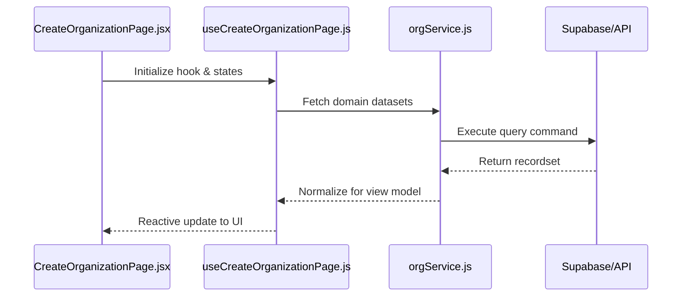
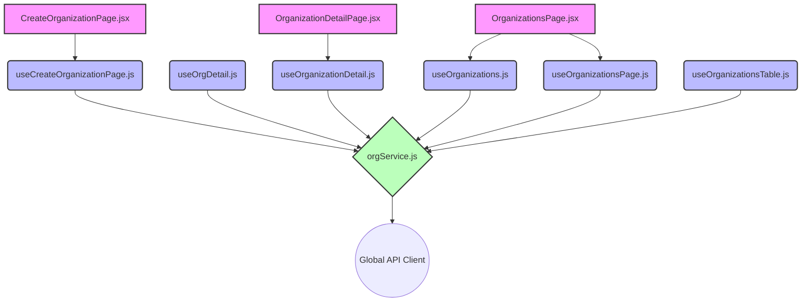

# Technical Specification: ORGANIZATIONS

## 🏛️ Domain Architecture

### Execution Sequence
How the view orchestrates logic through the headless hook layer.

### Dependency Topology
A visual map of file-level relationships within the organizations module.

## 📂 Implementation Audit

### 📄 Presentation (Pages)
| Entity | Logic Link | Complexity |
| :--- | :--- | :--- |
| `CreateOrganizationPage.jsx` | Direct | 270 LoC |
| `OrganizationDetailPage.jsx` | Direct | 162 LoC |
| `OrganizationsPage.jsx` | Direct | 202 LoC |

### ⚓ Headless Logic (Hooks)
| Controller | Domain Exports | Status |
| :--- | :--- | :--- |
| `useCreateOrganizationPage.js` | 1 handlers | Refactor |
| `useOrgDetail.js` | 1 handlers | Stable |
| `useOrganizationDetail.js` | 1 handlers | Stable |
| `useOrganizations.js` | 9 handlers | Stable |
| `useOrganizationsPage.js` | 1 handlers | Stable |
| `useOrganizationsTable.js` | 1 handlers | Stable |

### ⚡ Infrastructure (Services)
| Provider | Connectivity | Exports |
| :--- | :--- | :--- |
| `orgService.js` | Global API | 1 methods |

## 🎓 Technical Interview Highlights
- **Layered Decoupling**: The View Layer (3 nodes) has zero knowledge of API protocols, interacting only through `useCreateOrganizationPage`.
- **Service Abstraction**: `orgService` encapsulates all Supabase/REST logic, allowing for provider-agnostic business logic.
- **State Management**: Uses TanStack Query for server state and local useState/useReducer for UI-only transient states.

---
*Verified by Nexo Engineering Standards v5.0 | 2026*
