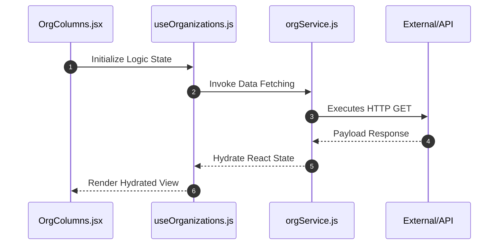

# Feature Intelligence: ORGANIZATIONS

## 🏛️ Architectural Topology
### 1. Thematic Dependency Graph
Babel-parsed internal mapping of module relationships.

```mermaid
%%{init: {'theme': 'neutral', 'themeVariables': { 'fontFamily': 'Inter', 'lineColor': '#6366f1' }}}%%
graph TD
    classDef page fill:#4f46e5,stroke:#3730a3,stroke-width:2px,color:#fff,rx:10,ry:10;
    classDef hook fill:#f8fafc,stroke:#cbd5e1,stroke-width:1px,color:#0f172a,rx:20,ry:20;
    classDef service fill:#0f172a,stroke:#000,stroke-width:2px,color:#f1f5f9,rx:5,ry:5;

    OrgColumnsjsx["OrgColumns.jsx"]:::page
    useOrganizationsjs["useOrganizations.js"]:::hook
    ResetPasswordModaljsx["ResetPasswordModal.jsx"]:::page
    ManageCouponsModaljsx["ManageCouponsModal.jsx"]:::page
    SendNotificationModaljsx["SendNotificationModal.jsx"]:::page
    OrgFormSectionsjsx["OrgFormSections.jsx"]:::page
    useOrgDetailjsx["useOrgDetail.jsx"]:::hook
    OrganizationsTablejsx["OrganizationsTable.jsx"]:::page
    AuditLogModaljsx["AuditLogModal.jsx"]:::page
    OrgChartsjsx["OrgCharts.jsx"]:::page
    useOrganizationsPagejs["useOrganizationsPage.js"]:::hook
    OrganizationsPagejsx["OrganizationsPage.jsx"]:::page
    useCreateOrganizationPagejs["useCreateOrganizationPage.js"]:::hook
    useOrganizationsTablejs["useOrganizationsTable.js"]:::hook
    OrgInfojsx["OrgInfo.jsx"]:::page
    useOrganizationDetailjs["useOrganizationDetail.js"]:::hook
    OrgHerojsx["OrgHero.jsx"]:::page
    OrganizationDetailPagejsx["OrganizationDetailPage.jsx"]:::page
    DisableOrgModaljsx["DisableOrgModal.jsx"]:::page
    ManagePlanModaljsx["ManagePlanModal.jsx"]:::page
    orgServicejs["orgService.js"]
    OrgStatsOverviewjsx["OrgStatsOverview.jsx"]
    CreateOrganizationPagejsx["CreateOrganizationPage.jsx"]:::page
    CouponAssignViewjsx["CouponAssignView.jsx"]:::page
    OrgSidebarjsx["OrgSidebar.jsx"]:::page
    OrgToolbarjsx["OrgToolbar.jsx"]:::page
    CouponListViewjsx["CouponListView.jsx"]:::page
    OrgStatsjsx["OrgStats.jsx"]
    OrgModalContainerjsx["OrgModalContainer.jsx"]:::page
    FormFieldjsx["FormField.jsx"]:::page
    StatusDropdownjsx["StatusDropdown.jsx"]
    OrgModalsjsx["OrgModals.jsx"]
    OrgColumnsjsx --> StatusDropdownjsx
    useOrganizationsjs --> orgServicejs
    ResetPasswordModaljsx --> useOrganizationsjs
    ManageCouponsModaljsx --> CouponListViewjsx
    ManageCouponsModaljsx --> CouponAssignViewjsx
    OrgFormSectionsjsx --> FormFieldjsx
    useOrgDetailjsx --> orgServicejs
    OrganizationsTablejsx --> OrgModalsjsx
    OrganizationsTablejsx --> useOrganizationsTablejs
    useOrganizationsPagejs --> useOrganizationsjs
    OrganizationsPagejsx --> OrganizationsTablejsx
    OrganizationsPagejsx --> OrgToolbarjsx
    OrganizationsPagejsx --> useOrganizationsPagejs
    useCreateOrganizationPagejs --> useOrganizationsjs
    useOrganizationsTablejs --> OrgColumnsjsx
    useOrganizationDetailjs --> useOrganizationsjs
    OrganizationDetailPagejsx --> OrgHerojsx
    OrganizationDetailPagejsx --> OrgInfojsx
    OrganizationDetailPagejsx --> OrgSidebarjsx
    OrganizationDetailPagejsx --> OrgChartsjsx
    OrganizationDetailPagejsx --> OrgStatsOverviewjsx
    OrganizationDetailPagejsx --> OrgModalContainerjsx
    OrganizationDetailPagejsx --> useOrgDetailjsx
    CreateOrganizationPagejsx --> useCreateOrganizationPagejs
    CreateOrganizationPagejsx --> OrgFormSectionsjsx
    OrgModalContainerjsx --> OrgModalsjsx
```

### 2. Execution Sequence
Runtime orchestration between View, Logic, and Infrastructure layers.

---

## 📡 API Surface (Inferred)
Automated mapping of external connectivity within this module.

| Method | Endpoint | Source Provider |
| :--- | :--- | :--- |
| - | - | - |

---

## 📂 Engineering Audit
| Entity | Score | Complexity | LoC | Status |
| :--- | :--- | :--- | :--- | :--- |
| `OrgColumns.jsx` | 33 | Low | 134 | ✅ STABLE |
| `useOrganizations.js` | 40 | Low | 121 | ✅ STABLE |
| `ResetPasswordModal.jsx` | 44 | Low | 112 | ✅ STABLE |
| `ManageCouponsModal.jsx` | 45 | Low | 110 | ✅ STABLE |
| `SendNotificationModal.jsx` | 45 | Low | 110 | ✅ STABLE |
| `OrgFormSections.jsx` | 49 | Low | 102 | ✅ STABLE |
| `useOrgDetail.jsx` | 50 | Low | 101 | ✅ STABLE |
| `OrganizationsTable.jsx` | 50 | Low | 101 | ✅ STABLE |
| `AuditLogModal.jsx` | 50 | Low | 100 | ✅ STABLE |
| `OrgCharts.jsx` | 52 | Low | 96 | ✅ STABLE |
| `useOrganizationsPage.js` | 56 | Low | 88 | ✅ STABLE |
| `OrganizationsPage.jsx` | 58 | Low | 84 | ✅ STABLE |
| `useCreateOrganizationPage.js` | 58 | Low | 84 | ✅ STABLE |
| `useOrganizationsTable.js` | 59 | Low | 82 | ✅ STABLE |
| `OrgInfo.jsx` | 59 | Low | 82 | ✅ STABLE |
| `useOrganizationDetail.js` | 64 | Low | 72 | ✅ STABLE |
| `OrgHero.jsx` | 66 | Low | 68 | ✅ STABLE |
| `OrganizationDetailPage.jsx` | 67 | Low | 67 | ✅ STABLE |
| `DisableOrgModal.jsx` | 68 | Low | 65 | ✅ STABLE |
| `ManagePlanModal.jsx` | 68 | Low | 65 | ✅ STABLE |
| `orgService.js` | 68 | Low | 64 | ✅ STABLE |
| `OrgStatsOverview.jsx` | 69 | Low | 62 | ✅ STABLE |
| `CreateOrganizationPage.jsx` | 71 | Low | 59 | ✅ STABLE |
| `CouponAssignView.jsx` | 72 | Low | 56 | ✅ STABLE |
| `OrgSidebar.jsx` | 75 | Low | 51 | ✅ STABLE |
| `OrgToolbar.jsx` | 77 | Low | 47 | ✅ STABLE |
| `CouponListView.jsx` | 79 | Low | 43 | ✅ STABLE |
| `OrgStats.jsx` | 79 | Low | 42 | ✅ STABLE |
| `OrgModalContainer.jsx` | 83 | Low | 35 | ✅ STABLE |
| `FormField.jsx` | 86 | Low | 28 | ✅ STABLE |
| `StatusDropdown.jsx` | 88 | Low | 24 | ✅ STABLE |
| `OrgModals.jsx` | 97 | Low | 7 | ✅ STABLE |

---
*Generated by Nexo Master Architect V24.0 | Institutional Standard*