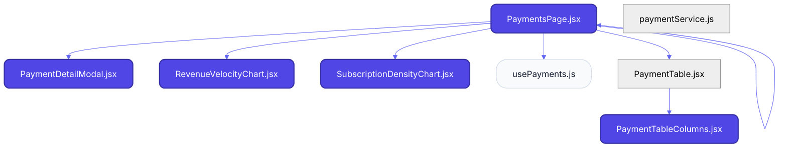
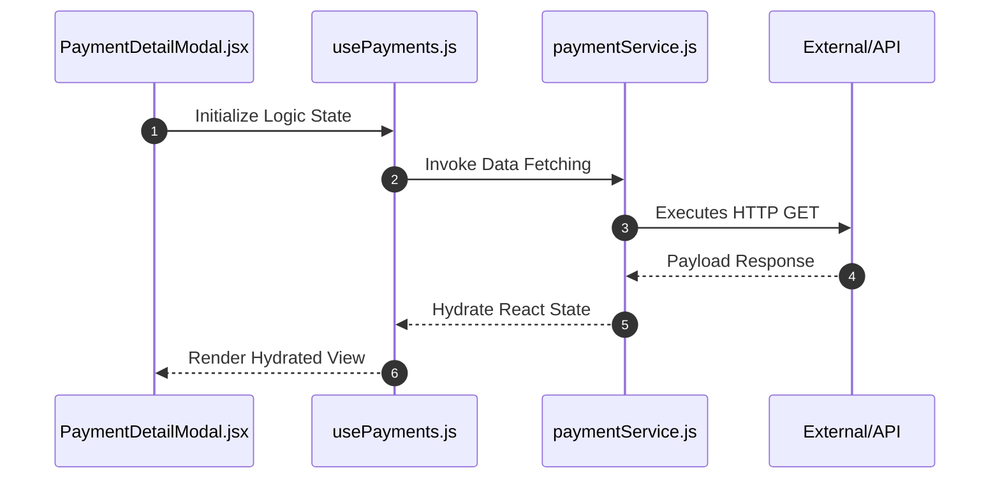

# Feature Intelligence: PAYMENTS

## 🏛️ Architectural Topology
### 1. Thematic Dependency Graph
Babel-parsed internal mapping of module relationships.

### 2. Execution Sequence
Runtime orchestration between View, Logic, and Infrastructure layers.

---

## 📡 API Surface (Inferred)
Automated mapping of external connectivity within this module.

| Method | Endpoint | Source Provider |
| :--- | :--- | :--- |
| - | - | - |

---

## 📂 Engineering Audit
| Entity | Score | Complexity | LoC | Status |
| :--- | :--- | :--- | :--- | :--- |
| `PaymentDetailModal.jsx` | 26 | Low | 149 | ✅ STABLE |
| `RevenueVelocityChart.jsx` | 27 | Low | 146 | ✅ STABLE |
| `SubscriptionDensityChart.jsx` | 39 | Low | 123 | ✅ STABLE |
| `PaymentsPage.jsx` | 54 | Low | 93 | ✅ STABLE |
| `PaymentTableColumns.jsx` | 57 | Low | 86 | ✅ STABLE |
| `usePayments.js` | 72 | Low | 57 | ✅ STABLE |
| `PaymentTable.jsx` | 79 | Low | 42 | ✅ STABLE |
| `paymentService.js` | 94 | Low | 13 | ✅ STABLE |

---
*Generated by Nexo Master Architect V24.0 | Institutional Standard*