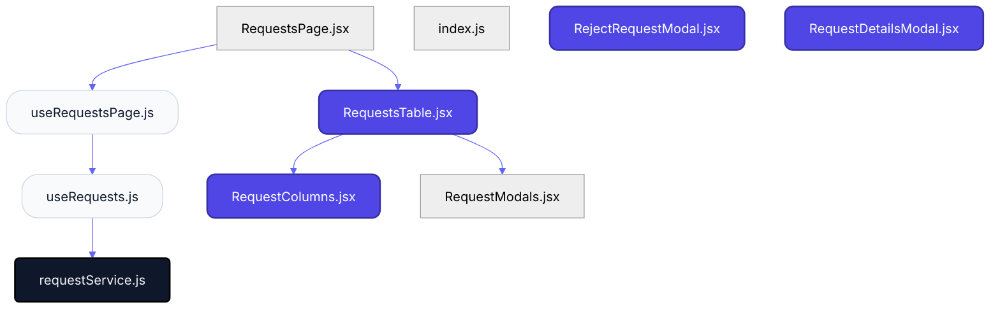
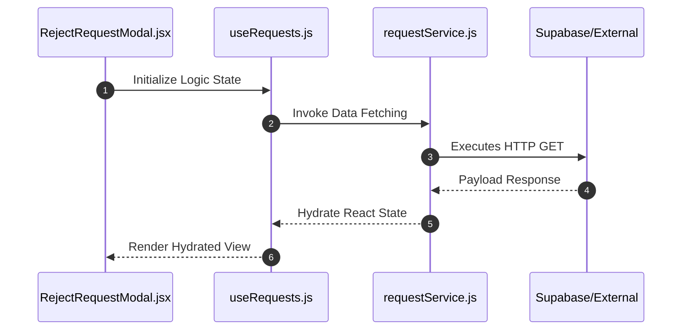

# Feature Intelligence: REQUESTS

## 🏛️ Architectural Topology

### 1. Thematic Dependency Graph
Babel-parsed internal mapping of module relationships.

### 2. Execution Sequence
Runtime orchestration between View, Logic, and Infrastructure layers.

---

## 📡 API Surface (Inferred)
Automated mapping of external connectivity within this module.

| Method | Endpoint | Source Provider |
| :--- | :--- | :--- |
| GET | `/requests` | requestService.js |

---

## 🛠️ Development Navigation
| Objective | Target Layer | Target File |
| :--- | :--- | :--- |
| **Change UI Layout** | Presentation (Pages) | `RejectRequestModal.jsx` |
| **Update Business Logic** | Logic (Hooks) | `useRequests.js` |
| **Modify Data Provider** | Infrastructure (Services) | `requestService.js` |

---

## 📂 Engineering Audit
| Entity | Score | Complexity | LoC | Status |
| :--- | :--- | :--- | :--- | :--- |
| `RequestsPage.jsx` | 30 | Low | 62 | ✅ STABLE |
| `index.js` | 0 | Low | 3 | ✅ STABLE |
| `useRequests.js` | 16 | Low | 42 | ✅ STABLE |
| `useRequestsPage.js` | 27 | Low | 112 | ✅ STABLE |
| `requestService.js` | 11 | Low | 10 | ✅ STABLE |
| `RejectRequestModal.jsx` | 32 | Low | 52 | ✅ STABLE |
| `RequestColumns.jsx` | 45 | Low | 119 | ✅ STABLE |
| `RequestDetailsModal.jsx` | 45 | Low | 71 | ✅ STABLE |
| `RequestModals.jsx` | 0 | Low | 3 | ✅ STABLE |
| `RequestsTable.jsx` | 38 | Low | 102 | ✅ STABLE |

---
*Generated by Nexo Apex Architect V8.0 | Institutional Standard*
