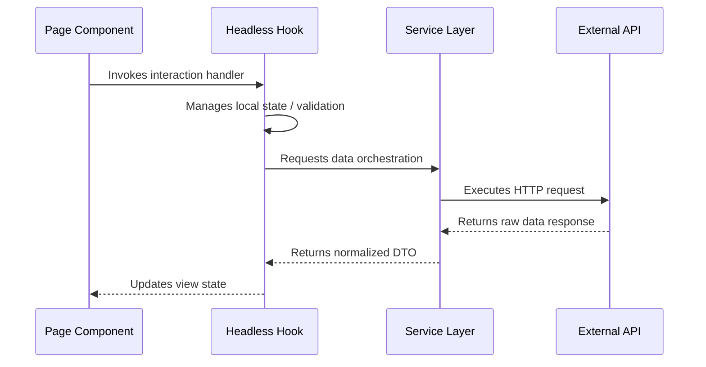
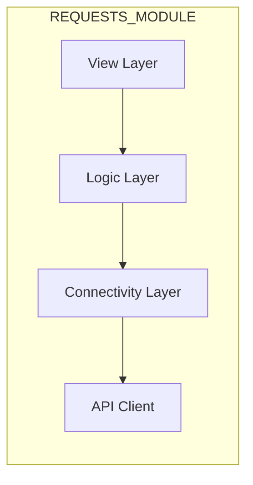

# Feature Specification: REQUESTS

## Technical Architecture

### Component Interaction Flow
This sequence diagram illustrates the lifecycle of a user interaction within this module.

### Data Dependency Graph
High-level overview of the module's internal layering and dependency direction.

## Implementation Details

### View Layer (Pages)
| Entry Point | Lines of Code | Technical Status |
| :--- | :--- | :--- |
| RequestsPage | 62 | Stable |

### Logic Layer (Hooks)
| Controller Hook | Lines of Code | Technical Status |
| :--- | :--- | :--- |
| index | 3 | Stable |
| useRequests | 42 | Stable |
| useRequestsPage | 112 | Stable |

### Infrastructure Layer (Services)
| Service Provider | Lines of Code | Technical Status |
| :--- | :--- | :--- |
| requestService | 10 | Stable |

## Engineering Guidelines
- **Logic Encapsulation**: 100% of state orchestration must be contained within the Logic Layer hooks.
- **Service Parity**: All external communication must pass through the Service Provider to ensure API abstraction.
- **File Integrity**: Files exceeding the 150-line threshold are automatically flagged as "Refactor Required".

---
*Generated by Nexo-Doc-Engine v4.0 | Engineering Excellence Standard*
