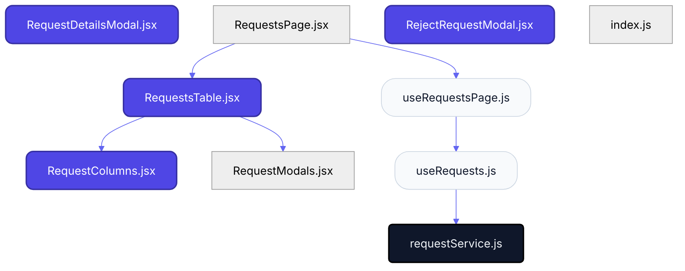
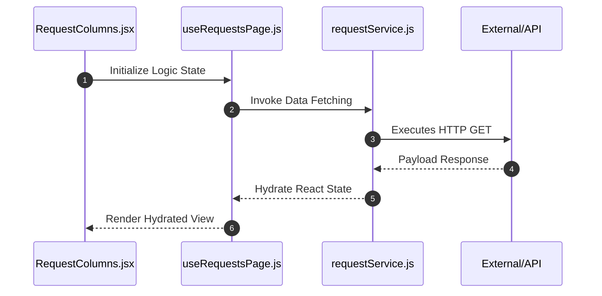

# Feature Intelligence: REQUESTS

## 🏛️ Architectural Topology
### 1. Thematic Dependency Graph
Babel-parsed internal mapping of module relationships.

### 2. Execution Sequence
Runtime orchestration between View, Logic, and Infrastructure layers.

---

## 📡 API Surface (Inferred)
Automated mapping of external connectivity within this module.

| Method | Endpoint | Source Provider |
| :--- | :--- | :--- |
| GET | `/requests` | requestService.js |

---

## 📂 Engineering Audit
| Entity | Score | Complexity | LoC | Status |
| :--- | :--- | :--- | :--- | :--- |
| `RequestColumns.jsx` | 41 | Low | 119 | ✅ STABLE |
| `useRequestsPage.js` | 44 | Low | 112 | ✅ STABLE |
| `RequestsTable.jsx` | 49 | Low | 102 | ✅ STABLE |
| `RequestDetailsModal.jsx` | 65 | Low | 71 | ✅ STABLE |
| `RequestsPage.jsx` | 69 | Low | 62 | ✅ STABLE |
| `RejectRequestModal.jsx` | 74 | Low | 52 | ✅ STABLE |
| `useRequests.js` | 79 | Low | 42 | ✅ STABLE |
| `requestService.js` | 95 | Low | 10 | ✅ STABLE |
| `index.js` | 99 | Low | 3 | ✅ STABLE |
| `RequestModals.jsx` | 99 | Low | 3 | ✅ STABLE |

---
*Generated by Nexo Master Architect V24.0 | Institutional Standard*