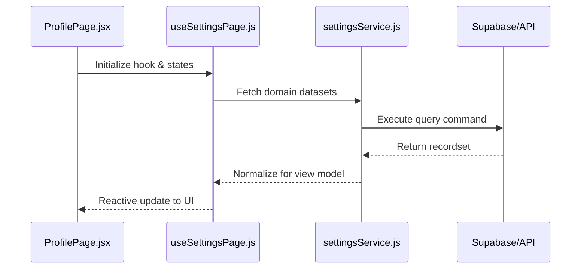
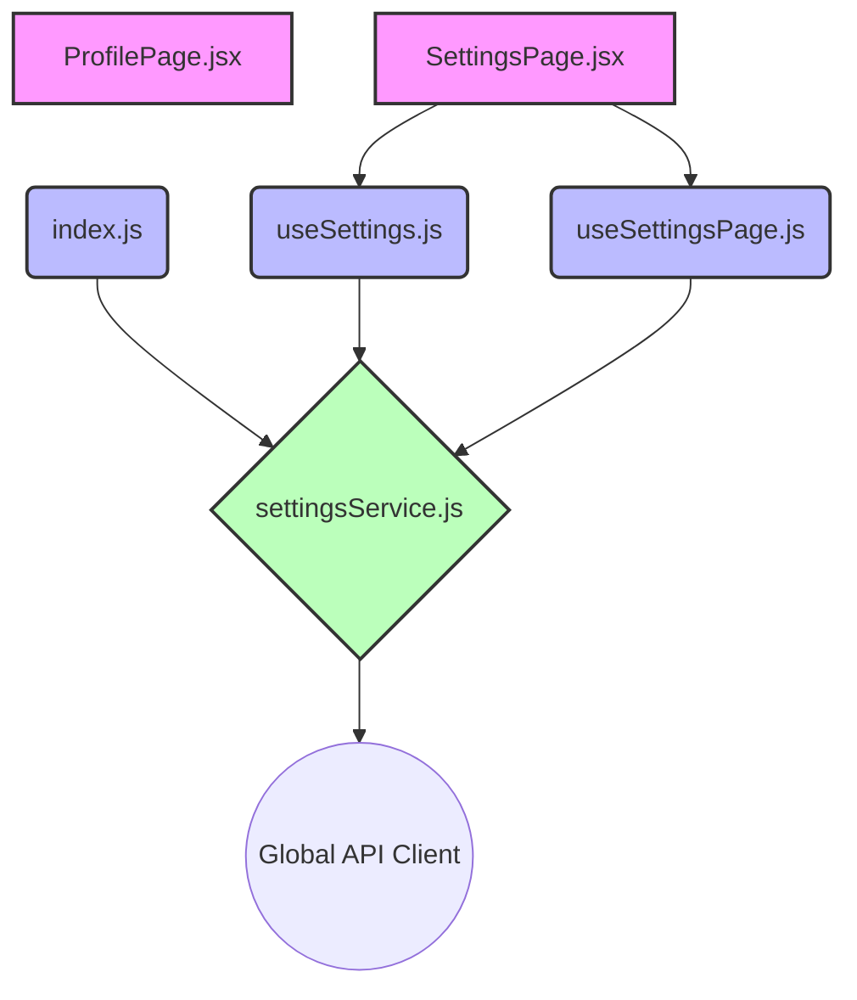

# Technical Specification: SETTINGS

## 🏛️ Domain Architecture

### Execution Sequence
How the view orchestrates logic through the headless hook layer.

### Dependency Topology
A visual map of file-level relationships within the settings module.

## 📂 Implementation Audit

### 📄 Presentation (Pages)
| Entity | Logic Link | Complexity |
| :--- | :--- | :--- |
| `ProfilePage.jsx` | Isolated | 267 LoC |
| `SettingsPage.jsx` | Direct | 107 LoC |

### ⚓ Headless Logic (Hooks)
| Controller | Domain Exports | Status |
| :--- | :--- | :--- |
| `index.js` | 0 handlers | Stable |
| `useSettings.js` | 2 handlers | Stable |
| `useSettingsPage.js` | 1 handlers | Stable |

### ⚡ Infrastructure (Services)
| Provider | Connectivity | Exports |
| :--- | :--- | :--- |
| `settingsService.js` | Global API | 1 methods |

## 🎓 Technical Interview Highlights
- **Layered Decoupling**: The View Layer (2 nodes) has zero knowledge of API protocols, interacting only through `index`.
- **Service Abstraction**: `settingsService` encapsulates all Supabase/REST logic, allowing for provider-agnostic business logic.
- **State Management**: Uses TanStack Query for server state and local useState/useReducer for UI-only transient states.

---
*Verified by Nexo Engineering Standards v5.0 | 2026*
