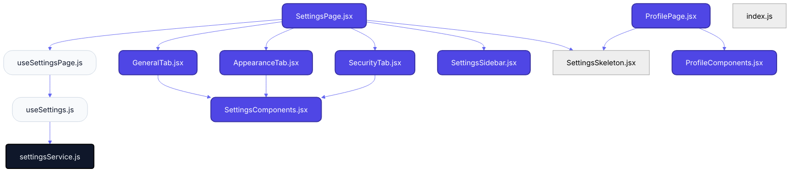
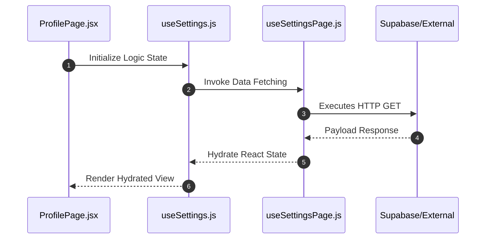

# Feature Intelligence: SETTINGS

## 🏛️ Architectural Topology

### 1. Thematic Dependency Graph
Babel-parsed internal mapping of module relationships.

### 2. Execution Sequence
Runtime orchestration between View, Logic, and Infrastructure layers.

---

## 📡 API Surface (Inferred)
Automated mapping of external connectivity within this module.

| Method | Endpoint | Source Provider |
| :--- | :--- | :--- |
| GET | `tab` | useSettingsPage.js |
| GET | `/system/settings` | settingsService.js |
| PUT | `/system/settings` | settingsService.js |

---

## 🛠️ Development Navigation
| Objective | Target Layer | Target File |
| :--- | :--- | :--- |
| **Change UI Layout** | Presentation (Pages) | `ProfilePage.jsx` |
| **Update Business Logic** | Logic (Hooks) | `useSettings.js` |
| **Modify Data Provider** | Infrastructure (Services) | `useSettingsPage.js` |

---

## 📂 Engineering Audit
| Entity | Score | Complexity | LoC | Status |
| :--- | :--- | :--- | :--- | :--- |
| `ProfilePage.jsx` | 41 | Low | 71 | ✅ STABLE |
| `SettingsPage.jsx` | 63 | Low | 107 | ✅ STABLE |
| `index.js` | 0 | Low | 3 | ✅ STABLE |
| `useSettings.js` | 14 | Low | 27 | ✅ STABLE |
| `useSettingsPage.js` | 33 | Low | 106 | ✅ STABLE |
| `settingsService.js` | 16 | Low | 9 | ✅ STABLE |
| `AppearanceTab.jsx` | 32 | Low | 65 | ✅ STABLE |
| `GeneralTab.jsx` | 32 | Low | 81 | ✅ STABLE |
| `ProfileComponents.jsx` | 49 | Low | 69 | ✅ STABLE |
| `SecurityTab.jsx` | 30 | Low | 57 | ✅ STABLE |
| `SettingsComponents.jsx` | 65 | Low | 103 | ✅ STABLE |
| `SettingsSidebar.jsx` | 27 | Low | 43 | ✅ STABLE |
| `SettingsSkeleton.jsx` | 0 | Low | 2 | ✅ STABLE |

---
*Generated by Nexo Apex Architect V8.0 | Institutional Standard*
