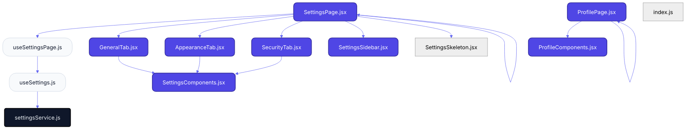
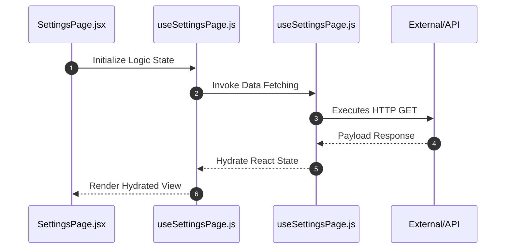

# Feature Intelligence: SETTINGS

## 🏛️ Architectural Topology
### 1. Thematic Dependency Graph
Babel-parsed internal mapping of module relationships.

### 2. Execution Sequence
Runtime orchestration between View, Logic, and Infrastructure layers.

---

## 📡 API Surface (Inferred)
Automated mapping of external connectivity within this module.

| Method | Endpoint | Source Provider |
| :--- | :--- | :--- |
| GET | `tab` | useSettingsPage.js |
| GET | `/system/settings` | settingsService.js |
| PUT | `/system/settings` | settingsService.js |

---

## 📂 Engineering Audit
| Entity | Score | Complexity | LoC | Status |
| :--- | :--- | :--- | :--- | :--- |
| `SettingsPage.jsx` | 47 | High | 107 | ⚠️ REFACTOR |
| `useSettingsPage.js` | 47 | Low | 106 | ✅ STABLE |
| `SettingsComponents.jsx` | 49 | High | 103 | ⚠️ REFACTOR |
| `GeneralTab.jsx` | 60 | Low | 81 | ✅ STABLE |
| `ProfilePage.jsx` | 65 | Low | 71 | ✅ STABLE |
| `ProfileComponents.jsx` | 66 | Low | 69 | ✅ STABLE |
| `AppearanceTab.jsx` | 68 | Low | 65 | ✅ STABLE |
| `SecurityTab.jsx` | 72 | Low | 57 | ✅ STABLE |
| `SettingsSidebar.jsx` | 79 | Low | 43 | ✅ STABLE |
| `useSettings.js` | 87 | Low | 27 | ✅ STABLE |
| `settingsService.js` | 96 | Low | 9 | ✅ STABLE |
| `index.js` | 99 | Low | 3 | ✅ STABLE |
| `SettingsSkeleton.jsx` | 99 | Low | 2 | ✅ STABLE |

---
*Generated by Nexo Master Architect V24.0 | Institutional Standard*